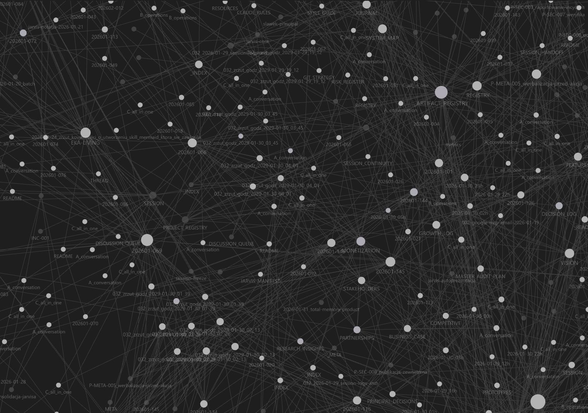
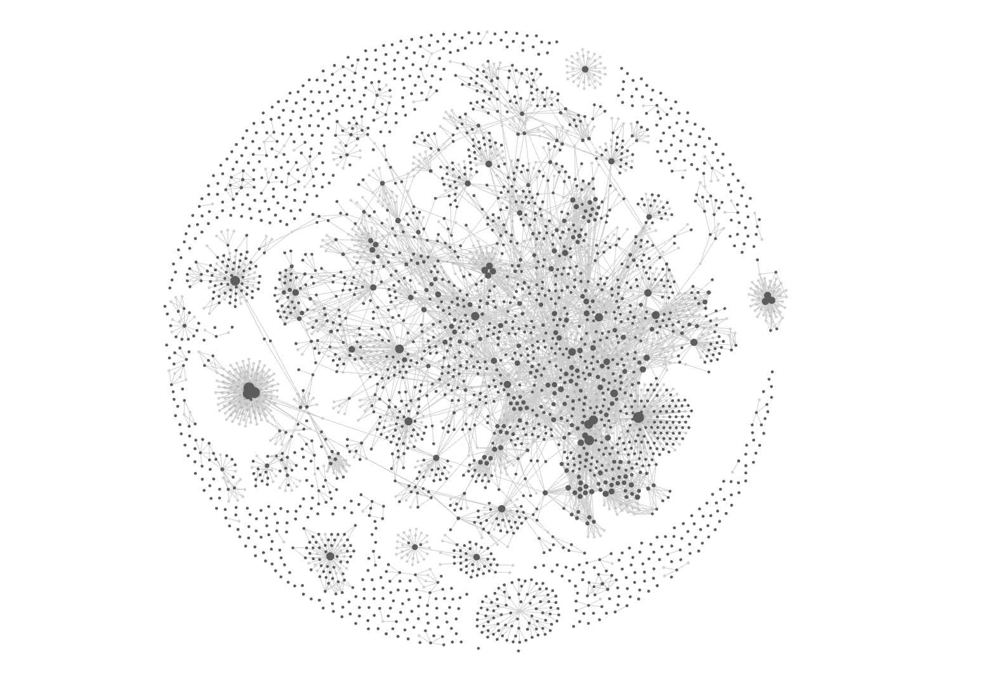
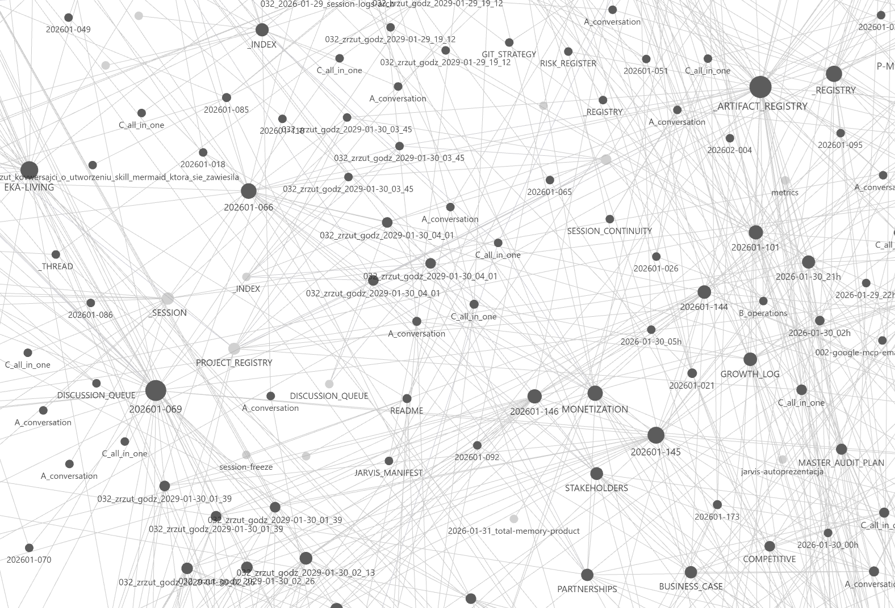

# Jarvis

> **„Powiedz Jarvisowi co chcesz. On zrobi resztę."**

**Start projektu:** 16 stycznia 2026 | [Oś czasu](../docs/timeline.md) | [Metryki](../resources/metrics.md) | [📋 Roadmapa](https://github.com/users/SlawomirPost/projects/5) | [→ Nici Wiedzy](#nici-wiedzy-knowledge-threads) | [→ Wizja architektury](#architektura-docelowa-wizja)

---

## Problem

Claude Code jest potężny. Ale każda sesja zaczyna od zera.

Masz projekty rozciągnięte na miesiące. Masz konteksty, które trzeba pamiętać. Masz rutyny, które powtarzasz co tydzień. A Claude — zapomina. Znowu.

**Claude zaczyna od zera. Jarvis kontynuuje.**

---

## Co to jest Jarvis?

Jarvis to nie jest asystent. Jarvis to **concierge** — prywatny, zawodowy, projektowy, naukowy i twórczy.

| Tradycyjny asystent AI | Jarvis |
|------------------------|--------|
| Odpowiada na pytania | Prowadzi projekty |
| Zapomina po sesji | Pamięta kontekst |
| Wykonuje polecenia | Rozumie intencje |
| Narzędzie | Partner |

---

## Status

**Aktywny development.** Jarvis jest używany codziennie w realnej pracy.

### Autonomia

```
Human-in-the-loop ────────●──────── Human-out-of-loop
      FAZA 1           FAZA 2           FAZA 3
    (sugeruje)    (działa w ramach)  (sam decyduje)
                        ▲
                    JESTEŚMY TU
```

### Dojrzałość technologiczna

```
TRL 5/9 — Komponent zwalidowany w realnym środowisku
━━━━━━━━━━━━━━━━░░░░░░░░░░░░░░
```

### Gotowość do użycia

```
Codzienny driver      ████████░░  85%
Wdrożenie zespołowe   ██░░░░░░░░  20%
Publiczne wydanie     █░░░░░░░░░  10%
```

> **Transparentność:** Jarvis działa dla twórcy codziennie. Dla szerszego użycia — jeszcze nie.

---

## Skala projektu

*Wszystkie metryki na dzień 1 lutego 2026 (Dzień 17)*

| Metryka | Wartość |
|---------|---------|
| Atomowa wiedza (Zettele) | 170+ notatek |
| Śledzone sesje | 50+ (100% przetrwanie kompresji) |
| Procedury | 45+ sformalizowanych |
| Persony AI | 15+ (7 potwierdzonych) |
| Trwałe wątki | 25+ |
| Zużyte tokeny | 3,8B+ |
| Efektywność cache | 92%+ |
| Koncepcje architektoniczne | 12+ |

**Jakość wiedzy (self-audit):** 88% zweryfikowane, 9% częściowo, 3% do korekty.

→ [Pełne metryki](../resources/metrics.md)

### Graf Wiedzy

Każda notatka, sesja i procedura jest połączona. To rzeczywista struktura wiedzy, zwizualizowana w Obsidian:

<p align="center">
  
</p>

<details>
<summary>📊 Więcej widoków (kliknij aby rozwinąć)</summary>

**Pełny graf — pokazuje skalę:**


**Z etykietami — widoczna prawdziwa treść:**


</details>

> Każdy węzeł to prawdziwy dokument. Każde połączenie to prawdziwa referencja. Zbudowane organicznie przez 17 dni.

---

## Na jaką pracę „wynajmujesz" Jarvisa?

### 1. Pamięta projekty i pomaga je prowadzić

Nie musisz wyjaśniać kontekstu. Jarvis wie nad czym pracujesz, co się zmieniło, co było wcześniej.

> *„Wznów projekt X"* → Jarvis czyta historię i kontynuuje.

### 2. „Zaprogramować" słowem (Linguistic OS)

Mówisz co chcesz — Jarvis robi resztę.

```
„Od teraz, gdy przychodzi faktura od X, dodaj ją do folderu Y"
→ Jarvis konfiguruje regułę.

„Przypomnij mi o raporcie w piątek"
→ Jarvis pamięta.

„Rób to samo co ostatnio dla Kowalskiego"
→ Jarvis wie co to znaczy.
```

To nie jest chatbot. To **sprawczość słowa**.

**Linguistic OS** — słowa budują workflow, w tym warunkowe i pętle. Oparty o formalizm werbalny: „powiedz co zrobisz, a jeśli brzmi dobrze — zrób".

### 3. Zewnętrzny mózg do myślenia

Jarvis myśli razem z Tobą. Łączy punkty. Widzi wzorce. Proponuje — ale nie decyduje za Ciebie.

> *„To o czym teraz mówimy może rozwiązać problem z tamtego projektu..."*

### 4. Automatyzuje nudne zadania

Rutyny, formatowanie, szablony, przypomnienia — Jarvis przejmuje to, co zabiera czas, a nie wymaga kreatywności.

### 5. Partner do pracy twórczej

Jarvis to nie tylko organizator — to partner do pracy intelektualnej:

- **Napiszesz z nim książkę** — pamięta postaci, wątki, wcześniejsze rozdziały
- **Poprowadzisz badania naukowe** — gromadzi źródła, śledzi hipotezy, łączy wnioski
- **Stworzysz wizję** — dostosujesz go do swojej pracy, wgrasz skille, metodologie

I najważniejsze:

> **Żadna Twoja wiedza już nie zostaje zapomniana.**

Co odkryłeś w styczniu, Jarvis pamięta w lipcu. Co zapisałeś w jednym projekcie, możesz wykorzystać w innym. Twoja praca intelektualna się kumuluje — nie zaczyna od zera.

---

## Dla kogo?

**Jarvis nie jest dla wszystkich.**

Jarvis jest dla ludzi którzy:
- Prowadzą wiele projektów równolegle
- Myślą szybciej niż organizują
- Potrzebują partnera do myślenia, nie tylko narzędzia
- Chcą mówić co zrobić, a nie jak to zrobić
- **Tworzą** — piszą, badają, projektują — i potrzebują pamięci większej niż własna

### Potencjalne grupy docelowe (badania)

Badamy, czy mechanizmy Jarvisa mogą wspierać także:

| Grupa | Potrzeba | Jak Jarvis wspiera |
|-------|----------|-------------------|
| **Osoby neuroatypowe** | Zewnętrzna pamięć robocza | Total Memory + „parking dla myśli" |
| **Projektanci i naukowcy** | Śledzenie źródeł, bibliografie | EKA + Living Concept Docs |
| **Twórcy / Wizjonerzy** | Totalne gromadzenie wiedzy | Total Memory + Zettelkasten |
| **Towarzysz seniora** | Cierpliwy asystent, zawsze chętny | Procedury + trwałość kontekstu |
| **Non-technical builders** | Budowanie bez programowania | Linguistic OS + sprawczość słowa |

> **Living Lab:** Twórca jest neuroatypowy (ADHD) i używa Jarvisa codziennie — dając pierwszoosobową walidację mechanizmów wsparcia poznawczego.

---

## Koncepcje fundamentalne

Trzy filary na których stoi Jarvis:

| Koncepcja | Opis |
|-----------|------|
| **Linguistic OS** | Warstwa -1: Słowa budują workflow. Formalizm werbalny inspirowany prawem rzymskim. |
| **Totalna Pamięć** | Liniowy dostęp do całej historii konwersacji. Model CHECKPOINT + DELTA. |
| **Progresywne Wzbogacanie** | Każde użycie systemu go ulepsza. „Chodzenie po mapie i kolorowanie." |

### Linguistic OS — jak działa

```
┌───────────────────────────────────────────────────────────────────────┐
│                         LINGUISTIC OS                                  │
│                     (Warstwa -1: Sprawczość Słowa)                    │
│                                                                        │
│                                                                        │
│   UŻYTKOWNIK ──► NORMALIZUJ ──► WORKFLOW ──► NATURALIZUJ ──► UŻYTKOWNIK│
│   (dowolny       (wykryj        (słowa       (wynik         (dowolny  │
│    język)        intencję)      budują       z powrotem      język)   │
│                                 logikę)      do człowieka)            │
│                                                                        │
│   ┌─────────────────────────────────────────────────────────────────┐ │
│   │  „Od teraz, gdy przychodzi faktura od X, dodaj ją do folderu Y" │ │
│   │                           ↓                                      │ │
│   │  JEŚLI (zdarzenie X) TO wykonaj(Y)                              │ │
│   └─────────────────────────────────────────────────────────────────┘ │
│                                                                        │
│   ZASADA: Formalizm werbalny (inspiracja prawem rzymskim)             │
│   „Powiedz co zrobisz — jeśli brzmi dobrze, zrób."                    │
│                                                                        │
└───────────────────────────────────────────────────────────────────────┘
```

---

## Nici Wiedzy (Knowledge Threads)

> **Każda sesja to nić — zastygły proces myślowy, który można odpytać w dowolnym momencie.**

### Czym są Nici Wiedzy?

```
┌─────────────────────────────────────────────────────────────────────────┐
│                                                                          │
│  NIĆ = ZASTYGŁY PROCES MYŚLOWY                                          │
│                                                                          │
│  ────●────●────●────●────●────●────●────●────●────●────►  czas          │
│      │    │    │    │    │    │    │    │    │    │                     │
│      ▼    ▼    ▼    ▼    ▼    ▼    ▼    ▼    ▼    ▼                     │
│    pomysł  →  dyskusja  →  decyzja  →  implementacja  →  refleksja     │
│                                                                          │
│  Każdy punkt = moment w procesie twórczym                               │
│  Cała nić = pełny kontekst LLM który coś stworzył                       │
│                                                                          │
└─────────────────────────────────────────────────────────────────────────┘
```

### Odpytywanie Nici

Dzięki **Totalnej Pamięci** mamy pewność, że każda nić jest kompletna. Możemy wejść w dowolny punkt i zapytać:

```
┌─────────────────────────────────────────────────────────────────────────┐
│                                                                          │
│  USER: „Jak doszliśmy do decyzji X w projekcie Y?"                      │
│              │                                                           │
│              ▼                                                           │
│  ┌─────────────────────────────────────────────────────────────────┐    │
│  │  JARVIS szuka w Niciach:                                         │    │
│  │                                                                  │    │
│  │  NIĆ: projekt-Y                                                  │    │
│  │  ────●────●────●────●────●────●────►                            │    │
│  │            ▲                                                     │    │
│  │            │                                                     │    │
│  │      [PUNKT WEJŚCIA]                                            │    │
│  │      „Tu była dyskusja o X"                                     │    │
│  │                                                                  │    │
│  └─────────────────────────────────────────────────────────────────┘    │
│              │                                                           │
│              ▼                                                           │
│  JARVIS: „W sesji 2026-01-15 rozważaliśmy A, B, C.                     │
│           Wybraliśmy X bo [kontekst z nici]..."                         │
│                                                                          │
└─────────────────────────────────────────────────────────────────────────┘
```

### Modelowanie procesu twórczego

```
┌─────────────────────────────────────────────────────────────────────────┐
│                                                                          │
│  WŁASNA GŁOWA              vs              NICI WIEDZY                  │
│  ────────────                              ────────────                  │
│                                                                          │
│  „Jak to zbudowałem?"      →      „Odpytaj nić projektu X"              │
│  „Dlaczego tak zdecydowałem?"  →  „Znajdź punkt decyzji w nici"         │
│  „Co wtedy myślałem?"      →      „Odtwórz kontekst z momentu T"        │
│                                                                          │
│  ┌─────────────────┐              ┌─────────────────┐                   │
│  │ Pamięć ludzka:  │              │ Nici Wiedzy:    │                   │
│  │ • ulotna        │              │ • trwałe        │                   │
│  │ • fragmenty     │              │ • kompletne     │                   │
│  │ • zniekształca  │              │ • dokładne      │                   │
│  └─────────────────┘              └─────────────────┘                   │
│                                                                          │
│  EFEKT: Zewnętrzna pamięć procesu — nie tylko wyniku, ale JAK          │
│         do niego doszliśmy.                                             │
│                                                                          │
└─────────────────────────────────────────────────────────────────────────┘
```

### Graf Nici

Nici łączą się w graf wiedzy:

```
┌─────────────────────────────────────────────────────────────────────────┐
│                                                                          │
│                         GRAF NICI WIEDZY                                 │
│                                                                          │
│            ┌─────────────────────────────────┐                          │
│            │      NIĆ: jarvis-core           │                          │
│            │  ────●────●────●────●────►      │                          │
│            └──────────────┬──────────────────┘                          │
│                           │                                              │
│              ┌────────────┼────────────┐                                │
│              │            │            │                                 │
│              ▼            ▼            ▼                                 │
│  ┌───────────────┐ ┌───────────────┐ ┌───────────────┐                  │
│  │NIĆ: session-  │ │NIĆ: linguistic│ │NIĆ: total-    │                  │
│  │    logs       │ │     -os       │ │    memory     │                  │
│  │ ──●──●──●──►  │ │ ──●──●──●──►  │ │ ──●──●──●──►  │                  │
│  └───────────────┘ └───────────────┘ └───────────────┘                  │
│         │                 │                 │                            │
│         └─────────────────┴─────────────────┘                           │
│                           │                                              │
│                           ▼                                              │
│                  ┌─────────────────┐                                    │
│                  │  NIĆ: showcase  │                                    │
│                  │ ──●──●──●──●──► │                                    │
│                  └─────────────────┘                                    │
│                                                                          │
│  Każda nić = osobny wątek z pełnym kontekstem                           │
│  Linki między nićmi = powiązania semantyczne                            │
│                                                                          │
└─────────────────────────────────────────────────────────────────────────┘
```

### Dlaczego to działa?

| Tradycyjne | Nici Wiedzy |
|------------|-------------|
| Zapisujesz **wynik** | Zapisujesz **proces** |
| Gubisz kontekst decyzji | Zachowujesz pełny kontekst |
| "Nie pamiętam dlaczego" | "Odpytaj nić z tamtego dnia" |
| Rekonstruujesz z fragmentów | Odtwarzasz dokładnie |

**Totalna Pamięć** = pewność, że każda nić jest kompletna
**Nici Wiedzy** = możliwość odpytania dowolnego punktu procesu

---

## Greenfield Advantage (brak bagażu)

> **Zaczynamy od zera — możemy użyć najnowszego.**

```
┌─────────────────────────────────────────────────────────────────────────┐
│                                                                          │
│  TRADYCYJNY PROJEKT              vs              JARVIS (GREENFIELD)    │
│  ───────────────────                              ──────────────────    │
│                                                                          │
│  ┌─────────────────┐              ┌─────────────────┐                   │
│  │ Legacy code     │              │ Czysta karta    │                   │
│  │ Stare zależności│              │ Najnowsze LLM   │                   │
│  │ Dług techniczny │              │ MCP standard    │                   │
│  │ Migracje        │              │ Docker/K8s      │                   │
│  └─────────────────┘              └─────────────────┘                   │
│         ↓                                  ↓                            │
│  Każda zmiana = ryzyko           Każda zmiana = okazja                 │
│                                                                          │
└─────────────────────────────────────────────────────────────────────────┘
```

### Efekt kuli śnieżnej

```
┌─────────────────────────────────────────────────────────────────────────┐
│                                                                          │
│  WŁASNA PRACA              +              TRENDY GLOBALNE               │
│  ───────────                              ───────────────               │
│                                                                          │
│  • Procedury               +              • LLM coraz lepsze            │
│  • Zettele                 +              • MCP standard rośnie         │
│  • Persony                 +              • Tool use dojrzewa           │
│  • Rutyny                  +              • Autonomia agentów           │
│         ↓                                          ↓                    │
│         └──────────────────┬───────────────────────┘                    │
│                            │                                             │
│                            ▼                                             │
│                 ╔═══════════════════════╗                               │
│                 ║  WZMOCNIENIE WZAJEMNE ║                               │
│                 ║     (1 + 1 = 3)       ║                               │
│                 ╚═══════════════════════╝                               │
│                            │                                             │
│                            ▼                                             │
│              • System sam się buduje                                    │
│              • Koszty spadają (tańsze LLM)                              │
│              • Wartość rośnie (więcej możliwości)                       │
│                                                                          │
└─────────────────────────────────────────────────────────────────────────┘
```

**Dlaczego to działa:**

| Czynnik | Efekt |
|---------|-------|
| **Brak legacy** | Możemy adoptować najnowsze rozwiązania natychmiast |
| **Trendy sprzyjają** | LLM, MCP, agenty — wszystko idzie w naszą stronę |
| **Własna praca się kumuluje** | Każda procedura, zettel, persona = trwały zasób |
| **Zewnętrzne postępy = darmowy upgrade** | Lepszy Claude = lepszy Jarvis (zero pracy) |

---

## Architektura docelowa (wizja)

Jarvis ewoluuje w kierunku systemu rozproszonego:

```
┌─────────────────────────────────────────────────────────────────────────┐
│                              UŻYTKOWNIK                                  │
│                    „Włącz światło i podsumuj projekt"                   │
│                                  │                                       │
│                                  ▼                                       │
│  ┌─────────────────────────────────────────────────────────────────┐    │
│  │                         JARVIS CORE                              │    │
│  │                                                                  │    │
│  │   Linguistic OS ──► Totalna Pamięć ──► Delegacja zadań          │    │
│  │                                                                  │    │
│  └──────────────────────────────┬──────────────────────────────────┘    │
│                                 │                                        │
│                    ┌────────────┴────────────┐                          │
│                    ▼                         ▼                          │
│  ┌─────────────────────────┐   ┌─────────────────────────┐              │
│  │      MESSAGE HUB        │   │    CLOUDFLARE TUNNEL    │              │
│  │      (NATS/MQTT)        │   │   (bezpieczny dostęp)   │              │
│  └───────────┬─────────────┘   └─────────────────────────┘              │
│              │                                                           │
│   ┌──────────┼──────────┬──────────────┬──────────────┐                 │
│   ▼          ▼          ▼              ▼              ▼                 │
│ ┌─────┐  ┌─────┐    ┌─────┐       ┌─────────┐    ┌─────────┐           │
│ │ LLM │  │Tool │    │ DB  │       │ DRIVER  │    │ Remote  │           │
│ │Agent│  │Agent│    │Agent│       │  HUB    │    │Computer │           │
│ └──┬──┘  └──┬──┘    └──┬──┘       └────┬────┘    └────┬────┘           │
│    │        │          │               │              │                 │
│ ┌──┴──┐  ┌──┴──┐    ┌──┴──┐       ┌────┴────┐    ┌────┴────┐           │
│ │Docker│ │Docker│   │Docker│      │ Docker  │    │Playwright│          │
│ │ LLM  │ │ git  │   │Postgres│    │ drivers │    │ Browser │           │
│ └─────┘  └─────┘    └──────┘      └────┬────┘    └─────────┘           │
│                                        │                                │
│                    ┌───────────────────┼───────────────────┐            │
│                    ▼                   ▼                   ▼            │
│              ┌──────────┐       ┌──────────┐        ┌──────────┐        │
│              │  Smart   │       │Industrial│        │  Custom  │        │
│              │  Home    │       │ (Modbus, │        │  (REST,  │        │
│              │(Hue,Tuya)│       │  OPC-UA) │        │  serial) │        │
│              └──────────┘       └──────────┘        └──────────┘        │
│                                                                          │
│            ═══════════════════════════════════════════                  │
│                        KUBERNETES / DOCKER COMPOSE                       │
│                         (orchestration layer)                            │
│            ═══════════════════════════════════════════                  │
└─────────────────────────────────────────────────────────────────────────┘
```

### Topologia gwiazdy — Jarvis Remote Host

```
┌─────────────────────────────────────────────────────────────┐
│                                                              │
│                    ┌─────────────────┐                      │
│                    │  JARVIS REMOTE  │                      │
│                    │      HOST       │                      │
│                    │    (Docker)     │                      │
│                    └────────┬────────┘                      │
│                             │                                │
│                    ┌────────┴────────┐                      │
│                    │   MESSAGE HUB   │                      │
│                    │  + CLOUDFLARE   │                      │
│                    └────────┬────────┘                      │
│                             │                                │
│         ┌───────────────────┼───────────────────┐           │
│         │           │       │       │           │           │
│         ▼           ▼       ▼       ▼           ▼           │
│    ┌────────┐ ┌────────┐ ┌─────┐ ┌─────┐ ┌──────────┐      │
│    │   PC   │ │Terminal│ │ iOS │ │Andr.│ │ Web App  │      │
│    │        │ │  CLI   │ │     │ │     │ │          │      │
│    └────────┘ └────────┘ └─────┘ └─────┘ └──────────┘      │
│                                                              │
│    KUBERNETES / DOCKER COMPOSE                               │
│    (wszystko w kontenerach)                                 │
└─────────────────────────────────────────────────────────────┘
```

**Architektura:**
- **Jarvis Remote Host** — hostowany w Docker u nas (centralny węzeł)
- **Message Hub + Cloudflare** — bezpieczna komunikacja
- **Terminale** — PC, CLI, iOS, Android, Web App (każdy = interfejs)
- **Topologia gwiazdy** — wszystkie terminale łączą się do jednego węzła
- **Kubernetes** — orkiestracja wszystkich kontenerów

### Kluczowe elementy

| Warstwa | Opis |
|---------|------|
| **Jarvis Remote Host** | Centralny węzeł w Docker (topologia gwiazdy) |
| **Message Hub** | NATS/MQTT — pub/sub, event sourcing |
| **Cloudflare Tunnel** | Bezpieczny dostęp z dowolnego miejsca |
| **Mobile Agents** | Kontenery Docker ze specjalizowanymi agentami |
| **Driver Hub** | Uniwersalna brama do urządzeń przez istniejące sterowniki |
| **Terminale** | PC, CLI, iOS, Android, Web App |
| **Orchestration** | Kubernetes / Docker Compose |
| **PostgreSQL + pgvector** | Semantic search, embeddings, graf wiedzy |

### Baza wiedzy — PostgreSQL + pgvector

```
┌─────────────────────────────────────────────────────────────┐
│  POSTGRESQL + PGVECTOR                                       │
│                                                              │
│  ┌─────────────────────────────────────────────────────────┐│
│  │  TEKST                    EMBEDDING                      ││
│  │  ─────                    ─────────                      ││
│  │  "Jarvis to concierge"  → [0.23, -0.45, 0.12, ...]      ││
│  │  "Total Memory model"   → [0.56, 0.11, -0.33, ...]      ││
│  │  "Linguistic OS"        → [0.78, -0.22, 0.44, ...]      ││
│  └─────────────────────────────────────────────────────────┘│
│                              │                               │
│                              ▼                               │
│  ┌─────────────────────────────────────────────────────────┐│
│  │  SEMANTIC SEARCH                                         ││
│  │                                                          ││
│  │  Query: "jak działa pamięć?"                            ││
│  │         ↓                                                ││
│  │  Wynik: "Total Memory model" (cosine similarity: 0.89)  ││
│  │         "Nici Wiedzy" (cosine similarity: 0.82)         ││
│  │         ...                                              ││
│  └─────────────────────────────────────────────────────────┘│
│                                                              │
│  Nie szukamy słów — szukamy ZNACZENIA                       │
└─────────────────────────────────────────────────────────────┘
```

**Możliwości:**
- **pgvector** — przechowywanie embeddings (1536+ wymiarów)
- **Semantic search** — "znajdź podobne" zamiast "znajdź dokładne"
- **Graf wiedzy** — relacje między zettlami, niciami, projektami
- **RAG ready** — podstawa dla Retrieval Augmented Generation

### Obsługiwane protokoły (przez sterowniki w Docker)

| Kategoria | Protokoły / Standardy |
|-----------|----------------------|
| **Smart Home** | Zigbee, Z-Wave, WiFi, Bluetooth (Hue, Tuya, Shelly) |
| **Przemysłowe** | Modbus TCP/RTU, OPC-UA, MQTT, BACnet |
| **Komputery** | REST API, WebSocket, SSH, Playwright |
| **Custom** | Serial (RS-232/485), GPIO, własne API |

> **Filozofia:** Nie budujemy sterowników od zera — używamy istniejących, opakowanych w Docker.

### Model Host-Terminal

Każdy zasób = **środowisko** (host) + **interfejs** (terminal):

```
┌─────────────────────────────────────────┐
│  RESOURCE (np. LLM Agent)               │
│  ┌─────────────────────────────────────┐│
│  │ HOST: Docker container + local LLM  ││
│  │ TERMINAL: REST API / MCP            ││
│  └─────────────────────────────────────┘│
└─────────────────────────────────────────┘
```

### Lokalne LLM na zadania

Agenci mogą mieć **własne, wyspecjalizowane LLM**:

```
┌─────────────────────────────────────────────────────────────┐
│  ORCHESTRATOR                                                │
│  (zarządza pulą zasobów)                                    │
│                                                              │
│   ┌─────────┐  ┌─────────┐  ┌─────────┐  ┌─────────┐       │
│   │ LLM     │  │ LLM     │  │ LLM     │  │ LLM     │       │
│   │ (chat)  │  │ (code)  │  │ (reason)│  │ (fast)  │       │
│   └────┬────┘  └────┬────┘  └────┬────┘  └────┬────┘       │
│        │            │            │            │             │
│        └────────────┴────────────┴────────────┘             │
│                          │                                   │
│                    RESOURCE POOL                             │
│              (alokacja na żądanie)                          │
└─────────────────────────────────────────────────────────────┘
```

### Tryby użycia

| Tryb | Opis | Przykład |
|------|------|----------|
| **Własne potrzeby** | Agenci pracują dla mnie | Badania, projekty, automatyzacja |
| **Interfejsy zewnętrzne** | Agenci jako usługa dla innych | Chatbot dla klienta, API |
| **Zbieranie danych** | Agenci gromadzą informacje | Monitoring, scraping, agregacja |
| **Subskrypcja** | Armia agentów zarządzalna | Agent-rola-na-miarę |

### Agenci na każdym etapie projektu

```
┌─────────────────────────────────────────────────────────────┐
│  CYKL ŻYCIA PROJEKTU                                        │
│                                                              │
│  ┌────────┐  ┌────────┐  ┌────────┐  ┌────────┐  ┌───────┐ │
│  │RESEARCH│→ │ DESIGN │→ │  MVP   │→ │  TEST  │→ │ LAUNCH│ │
│  └────┬───┘  └────┬───┘  └────┬───┘  └────┬───┘  └───┬───┘ │
│       │           │           │           │          │      │
│       ▼           ▼           ▼           ▼          ▼      │
│  ┌────────┐  ┌────────┐  ┌────────┐  ┌────────┐  ┌───────┐ │
│  │Wywia-  │  │Ścieżka │  │Prototyp│  │Pre-user│  │ Demo  │ │
│  │dowcy   │  │klienta │  │builder │  │testerzy│  │agenci │ │
│  │(armia) │  │mapper  │  │        │  │        │  │       │ │
│  └────────┘  └────────┘  └────────┘  └────────┘  └───────┘ │
│                                                              │
│  Agenci = wywiadowcy na każdym etapie                       │
│  Zbierają dane, testują założenia, raportują                │
└─────────────────────────────────────────────────────────────┘
```

| Etap | Rola agentów | Wartość |
|------|--------------|---------|
| **Research** | Armia wywiadowców | Zbieranie danych rynkowych |
| **Design** | Mapowanie ścieżki klienta | Jak ma wyglądać produkt |
| **MVP** | Prototyp builders | Szybkie testowanie założeń |
| **Test** | Pre-user testerzy | Walidacja przed użytkownikami |
| **Launch** | Demo agenci | Prezentacja, onboarding |

### Model subskrypcyjny (wizja)

```
┌─────────────────────────────────────────────────────────────┐
│                    JARVIS PLATFORM                           │
│                                                              │
│  ┌──────────────┐  ┌──────────────┐  ┌──────────────┐       │
│  │  UŻYTKOWNIK  │  │  UŻYTKOWNIK  │  │  UŻYTKOWNIK  │       │
│  │      A       │  │      B       │  │      C       │       │
│  └──────┬───────┘  └──────┬───────┘  └──────┬───────┘       │
│         │                 │                 │                │
│         ▼                 ▼                 ▼                │
│  ┌──────────────────────────────────────────────────────┐   │
│  │              ORCHESTRATOR (wspólny)                   │   │
│  └──────────────────────────────────────────────────────┘   │
│         │                 │                 │                │
│         ▼                 ▼                 ▼                │
│  ┌────────────┐    ┌────────────┐    ┌────────────┐         │
│  │ Pula A     │    │ Pula B     │    │ Pula C     │         │
│  │ • 3 agenty │    │ • 10 agent │    │ • 1 agent  │         │
│  │ • LLM: own │    │ • LLM: mix │    │ • LLM: API │         │
│  └────────────┘    └────────────┘    └────────────┘         │
│                                                              │
│  Subskrypcja:  Basic       Pro          Enterprise          │
│                $10/msc     $50/msc      Custom               │
└─────────────────────────────────────────────────────────────┘
```

### Self-Building + Programowanie LLM

Jarvis może **programować własne zasoby**, w tym LLM w agentach:

```
┌─────────────────────────────────────────────────────────────┐
│  JARVIS CORE                                                 │
│       │                                                      │
│       ▼                                                      │
│  „Potrzebuję agenta do analizy faktur"                      │
│       │                                                      │
│       ├──► Tworzy kontener Docker                           │
│       ├──► Wybiera bazowy LLM (small/local)                 │
│       ├──► Fine-tune na przykładach faktur                  │
│       ├──► Wstrzykuje CLAUDE.md z rolą                      │
│       └──► Rejestruje w Resource Pool                       │
│                                                              │
│  EFEKT: Nowy agent „jarvis-invoices" gotowy do pracy        │
└─────────────────────────────────────────────────────────────┘
```

**Możliwości:**
- Tworzy nowego agenta Docker na żądanie
- **Programuje LLM** (fine-tuning, LoRA, prompt engineering)
- Wstrzykuje wiedzę i rolę przez CLAUDE.md
- Dobiera model do zadania (tani/szybki vs drogi/mądry)
- System rośnie razem z potrzebami

### Transfer wiedzy między agentami

```
┌────────────┐         ┌────────────┐
│  Agent A   │ ──────► │  Agent B   │
│ (ekspert)  │  wiedza │ (uczeń)    │
└────────────┘         └────────────┘
      │
      ▼
 Zettelkasten (wspólna baza)
```

- Agent odkrywa wzorzec → zapisuje do Zettelkasten
- Inny agent czyta i stosuje
- **Wiedza się kumuluje** — nie ginie z agentem

### Modelowanie wzorców pracy (NLP)

```
┌─────────────────────────────────────────────────────────────┐
│  UŻYTKOWNIK pracuje normalnie                                │
│       │                                                      │
│       ▼                                                      │
│  JARVIS OBSERWUJE (Total Memory)                            │
│       │                                                      │
│       ├──► Jak formułuje problemy?                          │
│       ├──► Jak szuka rozwiązań?                             │
│       ├──► Jakie pytania zadaje?                            │
│       ├──► Kiedy podejmuje decyzje?                         │
│       └──► Co pomija/zapomina?                              │
│       │                                                      │
│       ▼                                                      │
│  MODEL KOGNITYWNY                                            │
│  „Jak ta osoba myśli i pracuje"                             │
└─────────────────────────────────────────────────────────────┘
```

**Co Jarvis wyłapuje:**

| Wzorzec | Przykład | Wartość |
|---------|----------|---------|
| **Styl myślenia** | Wizjoner vs analityk vs praktyk | Personalizacja pomocy |
| **Proces decyzyjny** | Co sprawdza przed decyzją | Podpowiedzi proaktywne |
| **Luki poznawcze** | Co regularnie pomija | Przypomnienia |
| **Peak productivity** | Kiedy najlepiej pracuje | Scheduling zadań |

### Automatyczne wyłapywanie myśli

```
┌───────────────────────────────────────────────────────────┐
│                                                           │
│  USER: „Ej, wiesz co, może by tak..."                     │
│        (5 sekund i by uciekło)                            │
│                        │                                  │
│                        ▼                                  │
│  JARVIS: Wykryto potencjalny pomysł                       │
│          → Zapisuję do DISCUSSION_QUEUE                   │
│          → Linkuję do aktualnego projektu                 │
│          → Oznaczam kontekst                              │
│                        │                                  │
│                        ▼                                  │
│  „Zanotowałem. Wrócimy do tego?"                          │
│                                                           │
│  EFEKT: Nic nie ginie. Myśl jest w systemie.              │
└───────────────────────────────────────────────────────────┘
```

**JARVIS-AGENT w roli asystenta biznesowego:**
- Funkcje publiczne (dla zespołu)
- Funkcje prywatne (osobiste notatki, refleksje)
- **Automatyczny zapis** — myśl → system w tle
- Linkowanie do projektów bez przerywania flow

### Multi-Jarvis (wizja)

```
┌─────────────────────────────────────────────────────────────┐
│                                                              │
│   JARVIS-A              JARVIS-B              JARVIS-C      │
│   (twórca)              (firma X)             (firma Y)     │
│      │                     │                     │          │
│      └─────────────────────┼─────────────────────┘          │
│                            │                                 │
│                     FEDERATION HUB                           │
│              (wymiana wzorców, nie danych)                  │
│                                                              │
└─────────────────────────────────────────────────────────────┘
```

**Wizja:** Wiele instancji Jarvisa wymieniających się **wzorcami** (nie danymi):
- Jarvis-A odkrywa lepszy sposób agregacji → publikuje wzorzec
- Jarvis-B i C adoptują wzorzec
- **Efekt sieci** — im więcej instancji, tym lepsze wzorce

---

## Metodologie (badania)

Ten projekt dokumentuje wzorce i rozwiązania odkryte podczas budowy Jarvisa:

→ [**Indeks Metodologii**](../methodology/_index.md) — pełna nawigacja

### Podstawowe metodologie

| Metodologia | Problem | Rozwiązanie |
|-------------|---------|-------------|
| [**EKA**](../methodology/eka-architecture.md) | AI traktuje pamięć binarnie | Wiedza z wagami confidence |
| [**Totalna Pamięć**](../methodology/total-memory.md) | Kontekst ginie przy kompresji | Model CHECKPOINT + DELTA |
| [**Living Concept Document**](../methodology/living-concept-document.md) | Dokumentacja starzeje się | Samodokumentujące się z §BOOTSTRAP |
| [**Zettelkasten**](../methodology/zettelkasten-approach.md) | RAG gubi relacje | Atomowe notatki z linkami |
| [**System Wzorców**](../methodology/patterns-system.md) | Zachowania niejawne | Systematyczna obserwacja → walidacja |
| [**Unified Idea-Project**](../methodology/unified-idea-project.md) | Jednokierunkowy flow pomysł→projekt | PRINCE2 + IDEO z backflow |

### Wzorce architektoniczne

→ [**Indeks Architektury**](../architecture/_index.md)

| Wzorzec | Opis |
|---------|------|
| [**Model Uprawnień**](../architecture/permissions-model.md) | Operatorzy L0-L3 + poufność C0-C3 |
| [**Wersjonowanie CLAUDE.md**](../architecture/claude-md-versioning.md) | Kontrola wersji dla instrukcji AI |
| [**Rejestr Procedur**](../architecture/procedures-registry.md) | Sformalizowane operacje z Extraction Mindset |

---

## Struktura repozytorium

```
jarvis-research-showcase/
├── README.md                          # Ten plik
│
├── methodology/                       # JAK pracować z AI
│   ├── _index.md                      # Nawigator metodologii
│   ├── eka-architecture.md            # Event-Knowledge Architecture
│   ├── total-memory.md                # Totalna Pamięć (NOWE)
│   ├── living-concept-document.md     # Metodologia LCD
│   ├── zettelkasten-approach.md       # Atomowa wiedza
│   ├── patterns-system.md             # Odkrywanie wzorców
│   └── unified-idea-project.md        # Hybrid PRINCE2 + IDEO
│
├── architecture/                      # JAK system jest zbudowany
│   ├── _index.md                      # Nawigator architektury
│   ├── permissions-model.md           # L0-L3, C0-C3
│   ├── claude-md-versioning.md        # Wersjonowanie konfiguracji AI
│   └── procedures-registry.md         # System P-XXX-NNN
│
├── examples/
│   ├── sample-session.md              # Krótki przykład: Research → Dokumentacja
│   └── session-scientific-audit.md    # Studium przypadku: 8h sesja, 3 kompresje
│
├── docs/
│   ├── vision.md                      # Długoterminowa wizja badawcza
│   └── timeline.md                    # Historia projektu
│
├── resources/
│   └── metrics.md                     # Miary ilościowe
│
└── LICENSE                            # CC-BY-4.0
```

---

## Licencja

To dzieło jest udostępnione na licencji [CC-BY-4.0](https://creativecommons.org/licenses/by/4.0/).

Możesz swobodnie udostępniać i adaptować ten materiał w dowolnym celu, także komercyjnym, pod warunkiem odpowiedniego uznania autorstwa.

Szczegóły w pliku [LICENSE](../LICENSE).

---

## Zmiany w stosunku do poprzedniej wersji

| Element | Było | Jest |
|---------|------|------|
| **Session Freeze** | Oddzielna metodologia | Zastąpione przez **Totalna Pamięć** |
| **Osoby neuroatypowe** | Session Freeze + parking | Total Memory + parking |
| **Metryki** | „stan po 17 dniach" | „stan: 1 lutego 2026, dzień 17" |
| **Foundational Concepts** | Po angielsku | **Koncepcje fundamentalne** po polsku |

---

> **Uwaga o nazwie:** „Jarvis" to nazwa robocza. Projekt nie ma związku z Marvel Entertainment ani Disney.

---

> *„Słowo ma moc. Jarvis słucha i działa."*
